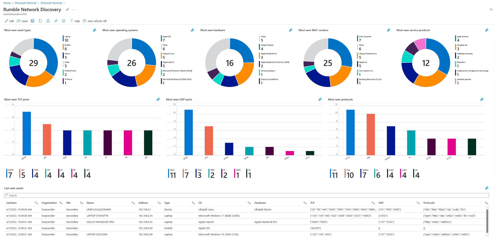

# Rumble Network Discovery solution for Microsoft Sentinel
The [Rumble Network Discovery](https://www.rumble.run/) solution for Microsoft Sentinel enables organizations to enrich their Microsoft Sentinel queries with a daily export of Rumble asset information, as well as recieve alerts regarding new or modified high value assets. 



The Rumble Network Discovery solution consists of the following resources:
 * **Data Connector**:
    * Azure Functions app, consisting of a unction with a timer trigger to fetch a daily export of asset information from the Rumble Organizations API (ingested into the RumbleAssets_CL table) and a function with a HTTP trigger to capture alerts for new and modified assets from the Rumble console (ingested into the RumbleAlerts_CL table).
    * Key vault, to securely store and retrieve secrets such as the Rumble Organization API key and Log Analytics workspace key.
    * Data connector within Microsoft Sentinel, to monitor the connectivity status of the connector.
 * **Parsers**: RumbleAssets and RumbleAlerts parsers, to filter and manipulate the raw data recieved from the Rumble API and rules engine.
 * **Workbook**: A workbook to monitor and query Rumble asset information, such as:
    * Most seen asset types, operating systems and hardware
    * Most seen TCP/UDP ports, protocols and products
    * An easily-searchable export of the Rumble asset information
 * **Hunting Queries**:
    * List all assets with exposed web interfaces using HTTP/S
    * List all Windows assets that have not sent security event logs to Microsoft Sentinel in the last week
 * **Watchlist**: A customizable watchlist, containing a list of high value assets that should be monitored for unauthorized changes.
 * **Analytic Rules**:
    * Alerts when new assets are discovered on the network
    * Alerts when a high value asset as been modified at the network level  (e.g. new IP addresses, exposed ports, etc).

This solution was developed entirely using Bicep, so you can re-use the resource declarations and other components in [mainTemplate.bicep](mainTemplate.bicep) as a reference for your own Microsoft Sentinel solutions.

## Deployment
>**Note:** The Rumble Network Discovery data connector uses [Azure Functions](https://azure.microsoft.com/pricing/details/functions/) to ingest asset information and alerts into Microsoft Sentinel, as well as [Key Vault](https://azure.microsoft.com/en-us/pricing/details/key-vault/) to securely store secrets, which may result in additional charges for your Azure subscription.
### 1. Create a Rumble Organization API key
1. Log in to the [Rumble console](https://console.rumble.run/)
2. Navigate to [Organizations](https://console.rumble.run/organizations) and select your organization
3. Under API tokens, click Generate API Key and copy the token value

### 2. Copy your Log Analytics workspace ID, key & name
1. In your Microsoft Sentinel instance, navigate to Settings > Workspace settings > Agents management
2. Copy your Log Analytics workspace ID and primary key
3. Make note of your Log Analytics workspace name

### 3. Deploy the Azure Resource Manager (ARM) template
1. Click the **Deploy to Azure** button below

[](https://portal.azure.com/#create/Microsoft.Template/uri/https%3A%2F%2Fraw.githubusercontent.com%2Fjoshua-a-lucas%2FRumble-MicrosoftSentinel%2Fmain%2FmainTemplate.json)

2. Select your desired **Subscription**, **Resource Group** and **Location**
3. Enter the **Rumble API key**, **Workspace name**, **Workspace ID** and **Workspace key**
4. Click **Review + create**
5. Wait for the deployment to finish successfully

### 4. Copy your Azure Functions webhook URL
1. Open your Azure Function app (e.g. Rumble-FunctionApp) in the Azure Portal
2. Navigate to Functions > Get-RumbleAlerts > Overview, click 'Get Function Url' and copy the URL. This is the webhook URL you will need to create a Rumble alert channel in Step 5.
3. (Optional) By default, the Azure Functions data connector is configured to send an export of Rumble assets to Microsoft Sentinel daily at 12 PM UTC. If you wish to manually trigger an initial export to verify the connector is working as expected, navigate to Functions > Get-RumbleAssets > Code + Test, click 'Test/Run' > Run. You should see data populate in the RumbleAssets_CL table in Microsoft Sentinel within the next 15-20 minutes.

### 5. Create Rumble alert channels, templates & rules
1. Navigate to the [Rumble Alerts > Channels](https://console.rumble.run/alerts/channels) page, and create a new webhook channel as follows:
    * **Name**: Microsoft Sentinel
    * **Channel type**: Webhook
    * **Webhook URL**: \<Copied from Step 4>
2. Navigate to the [Rumble Alerts > Templates](https://console.rumble.run/alerts/templates) page, and create a JSON [alert template](https://www.rumble.run/docs/creating-alert-templates/) for 'new asset' events as follows:
    * **Name**: New Assets Template
    * **Template type**: JSON
    * **Body of message**: \<Contents of **Rumble-MicrosoftSentinel/Data Connectors/newAssetTemplate.txt**>
    ```
    {
    {{#rule.is_scan}}
        {{#scan}}
        "new": {{assets_new}},
        "changed": {{assets_changed}},
        {{/scan}}
        "new_assets": [
            {{#report.new}}
            {
                "addresses": "{{addresses}}",
                "alive": "{{alive}}",
                "created_at": "{{created_at}}",
                "detected_by": "{{detected_by}}",
                "domains": "{{domains}}",
                "first_seen": "{{first_seen}}",
                "hw": "{{hw}}",
                "id": "{{id}}",
                "last_seen": "{{last_seen}}",
                "names": "{{names}}",
                "os": "{{os}}",
                "service_count": "{{service_count}}",
                "type": "{{type}}",
                "updated_at": "{{updated_at}}"
            },
            {{/report.new}}
        ]
    {{/rule.is_scan}}
    }
    ```
3. Navigate to the Rumble [Alerts > Rules](https://console.rumble.run/alerts/rules) page, and [create a rule](https://www.rumble.run/docs/rules-engine/) for 'new asset' events as follows:
    * **Name**: New Assets Rule
    * **Event**: new-assets-found
    * **Specify matching criteria for post-scan asset changes**: "is greater than or equal to" & "1"
    * **Limit to organization**: any
    * **Limit to site**: any
    * **Action**: Notify
    * **Notification channel**: Microsoft Sentinel (as created previously)
    * **Notification template**: New Assets Template (as created previously)
4. Repeat Steps 2-3 to additionally create an asset template and associated rule for 'changed asset' events. Refer to **Rumble-MicrosoftSentinel/Data Connectors/changedAssetTemplate.txt** for the template body, and use the 'assets-changed' event when creating the rule.
5. Rumble will now send alerts to Microsoft Sentinel via the Azure Functions data connector when a scan task discovers new or modified assets.

### 6. (Optional) Create a scheduled Rumble scan task
1. Rumble will only send alerts regarding new or modified assets following a completed scan task. To automate this process, create a scheduled scan task that runs hourly by navigating to the Rumble [Tasks > Overview](https://console.rumble.run/tasks) page, and create a new [scheduled scan](https://www.rumble.run/docs/managing-tasks/) that runs hourly.

### 7. Verify connectivity and enable scheduled analytic rules
1. Verify data is populating in the RumbleAssets_CL and RumbleAlerts_CL tables and that the RumbleAssets and RumbleAlerts parsers are working as expected.
> **Note**: It may take 15-20 minutes for data to be available in Log Analytics after enabling the data connector and triggering a function for the first time
2. Navigate to the Analytics page in Microsoft Sentinel and enable the following rules:
    * (Rumble) High value network asset changed
    * (Rumble) New network assets discovered